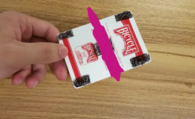
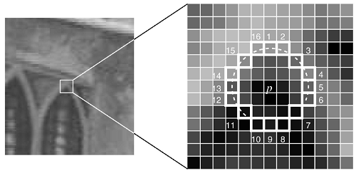
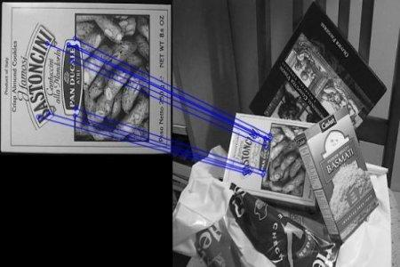
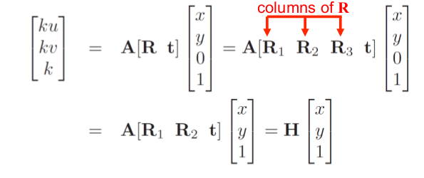
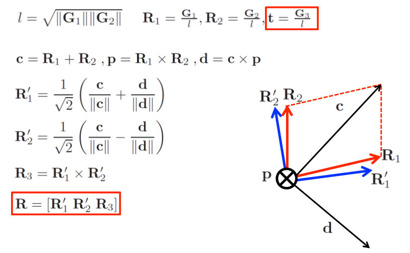

# AR Model

Bases on ORB feature to build AR Model，this project first try to find the platform then project 3D model on it. The final result is showing below：



## Reference

[Brute-Force特征匹配](https://www.jianshu.com/p/ed57ee1056ab)

[OBJ Format](https://www.jianshu.com/p/f7f3e7b6ebf5)

[FAST角点检测](https://blog.csdn.net/yc461515457/article/details/48625621)

[神力AI](http://manaai.cn)

## Prepare for background picture

In ar_main.py there is bachgroundcard.jpg, please replay it with your own background picture. Please save 3D obj format documents in folder models.

## Main processing

#### Extract Fast(Features from Accelerated Segment Test) and rotation brief feature.
Select a pixel P from the picture. Then we will determine whether it is a feature point. We first set its brightness value to Ip.

Set an appropriate threshold t.

Consider a discrete Bresenham circle with a radius equal to 3 pixels centered on the pixel point. There are 16 pixels on the boundary of the circle (as shown in Figure below).



Figure 1. Schematic diagram of FAST feature points

Now, if there are n consecutive pixels on this 16-pixel circle, their pixel values ​​are either larger than Ip + t or smaller than Ip−t, then it is a corner point.

#### Detect the platform(background)

We need to find the mapping relationship with the target picture according to the sample background picture, and then determine a transformation matrix. This operation is called Homography, try to build homography matrix, it connect background card coordinate to camera pixel system.




#### Project 3D Model on the 2D backgroundcard


Obtain a corrected coordinate system based on the homography matrix and external parameters of the camera, and place the OBJ stereo model on it;

Camera external parameters is a projecting transformation between physical world system to camera coordinate system.



As shown in the figure above, usually, the camera's external parameters will have two sets of parameters. Three translation coordinates of a three-dimensional coordinate system, and a set of rotation angles. We can remove z, that is, remove R3, because we want to project the OBJ into a plane, then z is naturally 0.



## Run

```
python3 ar_main.py

```
```
parsers: -r/-mk/-fk/-ma/-mo

```
